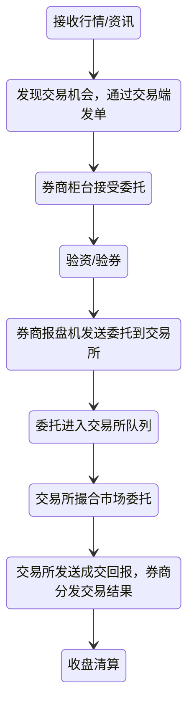
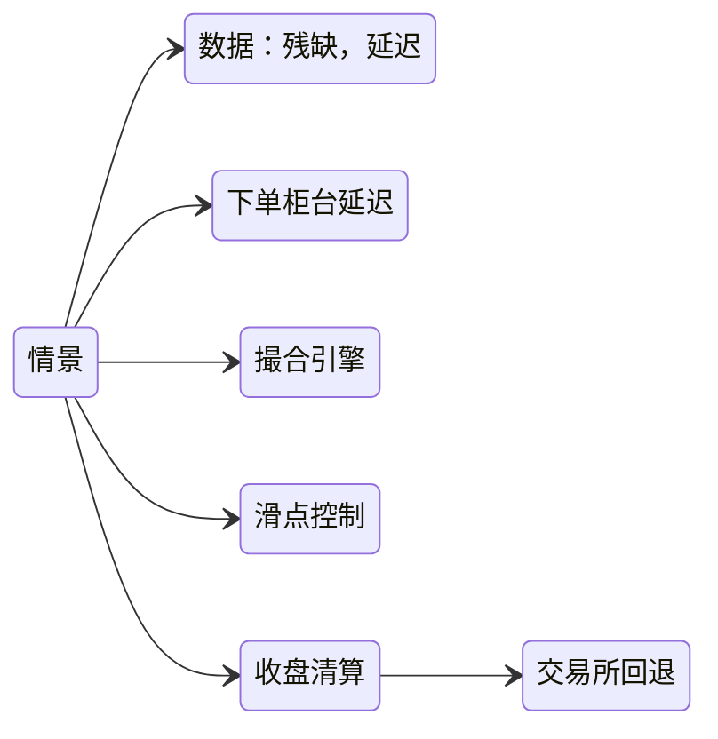
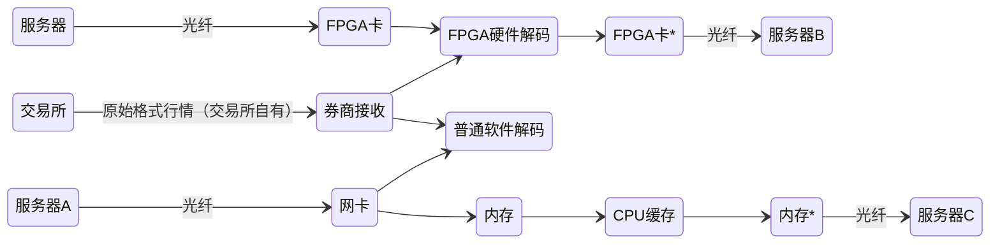
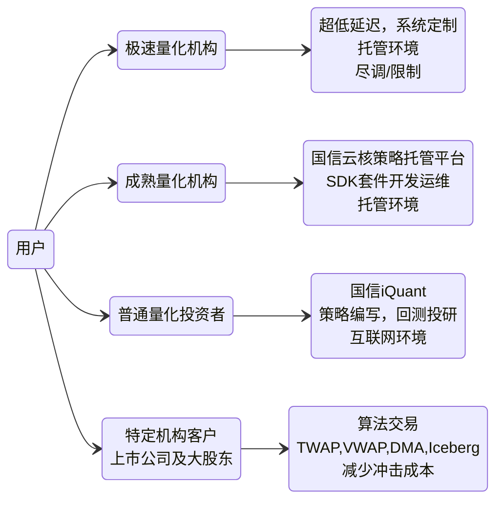
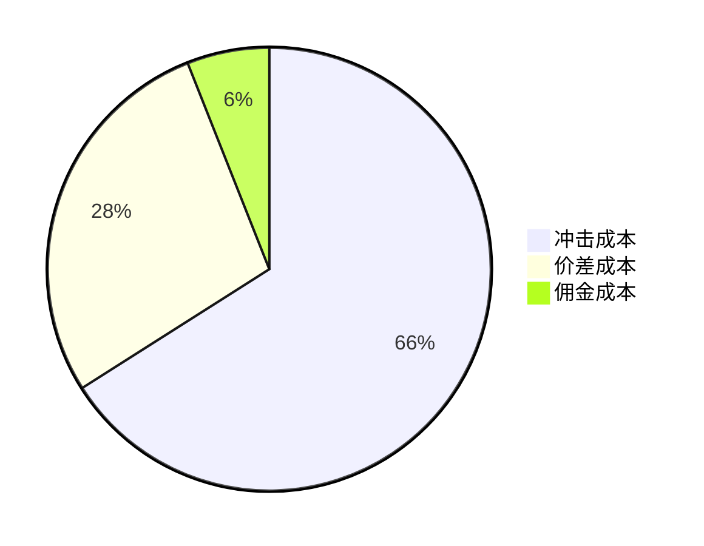
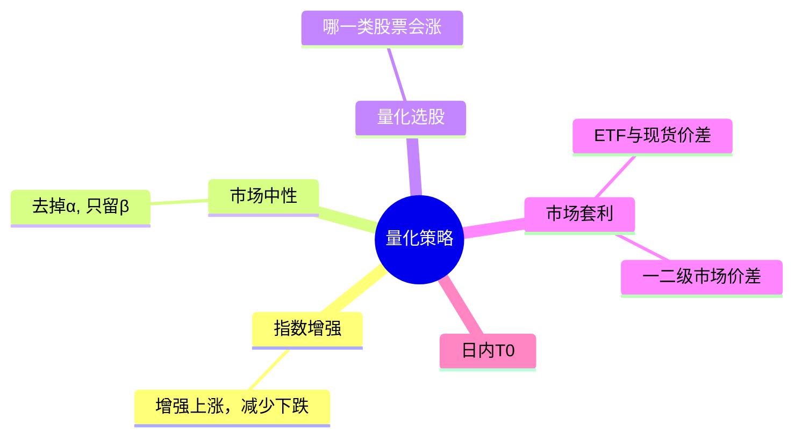

原主题：**AI时代的量化投资**（实际上是介绍市场基础内容）

仓库笔记标题：11.12 国信参访笔记-发布版

[AI时代的量化投资_笔记整理.pdf](<https://liubinfighter.github.io/Blog/post/guoxin_ai_trading/AI时代的量化投资 笔记整理.pdf>)

- 主讲人：国信证券 曾先生

- 笔记整理者： Jay Bridge 刘华杰 （南科大 普利智策）

风险提示：本文整理者没有金融相关执照，不保证内容完整清晰，不构成任何投资建议。笔记整理仅供参考/学习交流用。

>[!notes]
>本次涉及AI的部分着墨不多，主要是给大家一个对市场的overview

## 市场挂单委托的旅途

信息/资讯：wind，iFinD，券商app页面
交易端发单：PB（如恒生），功能：交易所风控（比如：行业持仓占比）

## 数据

### 基本数据

- level 1 五档盘口 3s推送
- level 2 逐笔数据（市场snapshot） 即量价数据，每笔推送

### 国信：GFinD

急速行情和大数据

### 数据解析

传统的解码方式比较慢
通过FPGA硬解码，可以达到各类延迟最大限度地降低，到3ns尺度左右（交换机延迟）

## 服务

### 用户画像

### 分布式柜台

资金和持仓，分沪市/深市两地，在对应柜台服务器进行订单处理

### 算法交易

交易成本：冲击成本，速度，规模，大机构的致命伤

市场环境：2020年后涌现出许多算法公司，比较新

>[!优势]
>1. 降低交易成本 
>    - 分拆母单，拟合市场成交量分布，战胜市场均价
>2. 降低人力成本
>    - 高盛-自动化货币交易：4个交易员=1个计算机工程师
>3. 减少监管以及合规性风险
>    - 实盘回测经验设置参数
>4. 隐藏交易意图
>    - 避免引起市场异动，保护交易意图
>5. 机器理性
>    - 规避人性 贪婪-恐惧

量价数据+新闻面因子挖掘

#### 效果对比

- 沪市人工交易 人工交易冲击成本 60个基点
- 美/英/日/港 平均冲击成本 10个基点
- 国内算法交易 5-15个基点
    可降低50个基点左右，消除85%的冲击成本

- 举例：卡方Plus算法跟踪上证指数

#### 商业模式和潜力

按成交额/节省成本等收费，前景广阔

### 量化策略

2010年前的量化：excel 中低频

#### 策略分类

>[!市场套利]
>ETF与现货价差（涨停板限制）以及流动性差（T0与T1）套利
>期货期权 股指等套利策略
>- 优势：回撤小，按周结算无回撤
>- 缺点：容量小，crowding out，市场风格切换

#### AI辅助面

1. 消息面（公告出来了进行分析+自动下单）
2. 因子挖掘（可解释性）
3. 量价形态（自动训练，识别）
