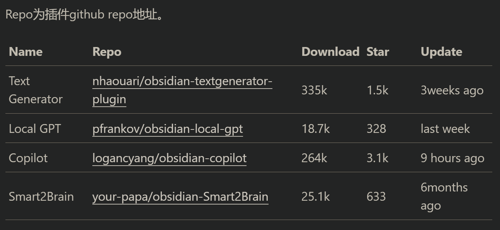
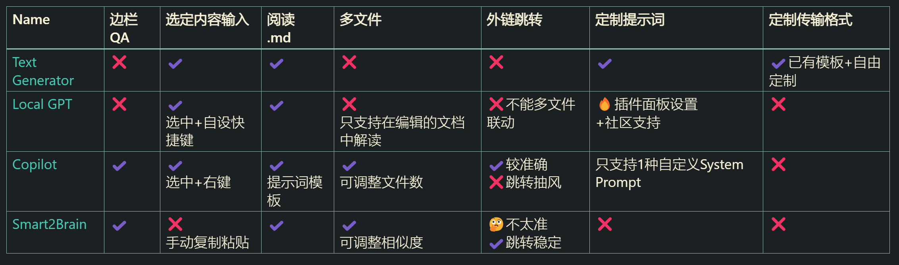
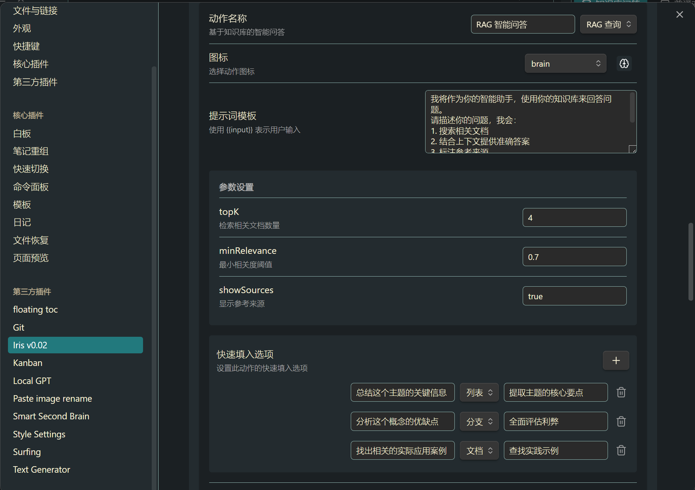
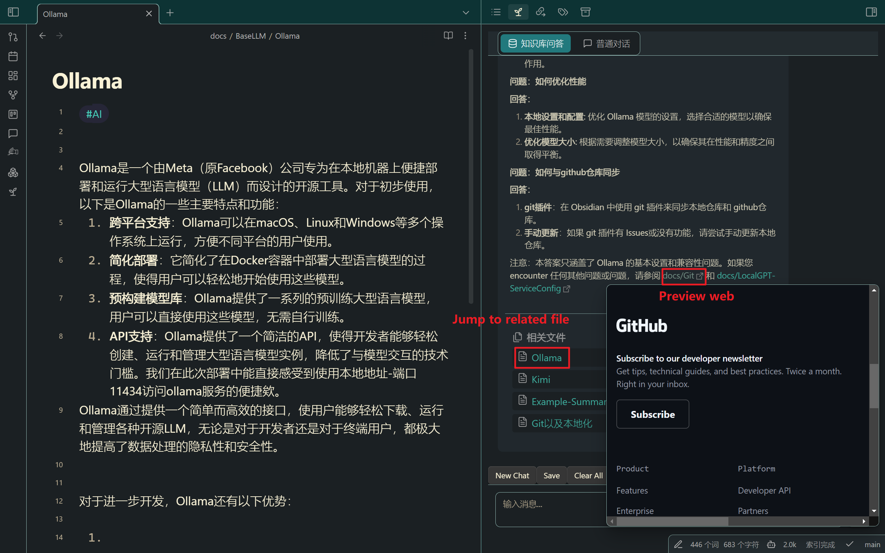
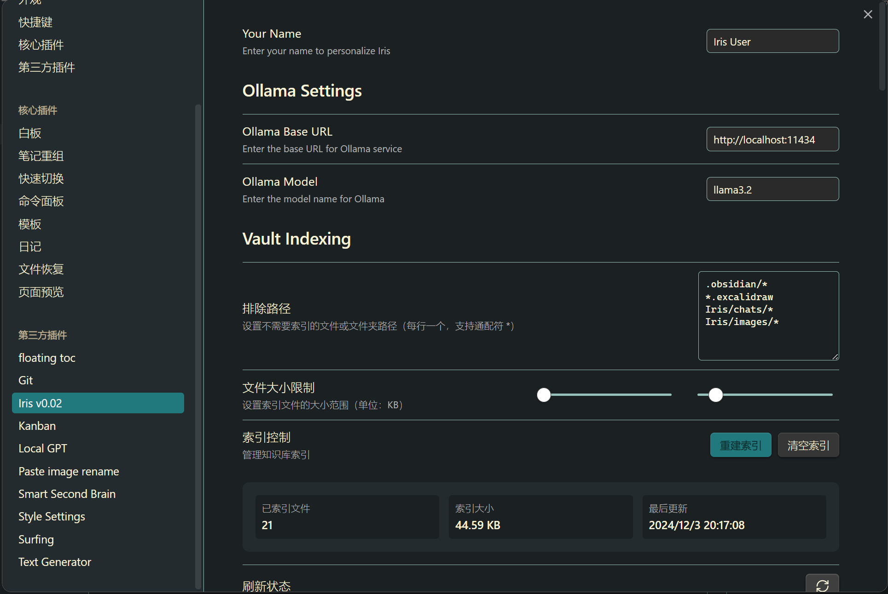

# IrisChatBox & Sample_AI_workspace

Github: [LIUBINfighter/Sample_AI_Workspace: Design a workflow/workspace with obsidian AI plugins and Ollama fine-tunning. AI Term Project for EBA203 Management Information System. ](https://github.com/LIUBINfighter/Sample_AI_Workspace)

## **Business Challenge**

The challenge lies in enhancing the Obsidian writing experience by enabling users to interact with their notes in a conversational manner, utilizing advanced language services. This not only improves the way users organize and retrieve information but also addresses the need for privacy in local writing. Users expect their data to remain secure and not be transmitted over the internet, which is crucial for protecting sensitive information.

**Solution:** To address this challenge, a comprehensive solution involves several key components:

1. **Local Deployment of Large Language Models (LLMs):** By deploying LLMs locally, we ensure that the processing and generation of language remain on the user's device. This eliminates the need for data to be sent to external servers, thus enhancing privacy and security.

2. **Vectorization of Repositories:** Transforming text data into vector representations allows for more efficient storage and retrieval. This technology enables the Obsidian system to understand the context and relationships between different notes, facilitating better search and discovery capabilities within the user's knowledge base.

3. **Integration of Chatbox:** Incorporating a Chatbox feature into Obsidian allows users to have a more natural and interactive way of querying their notes. The Chatbox acts as an interface for users to pose questions or give commands in a conversational manner, making it easier to navigate and interact with their notes.

4. **Embedding ActionCall in Obsidian:** ActionCall is a feature that enables users to execute specific actions or commands directly from within Obsidian. This could include tasks like creating new notes, tagging information, or automating workflows based on user input. By embedding ActionCall, we provide a more dynamic and responsive writing environment that adapts to the user's needs.


By implementing these solutions, Obsidian can offer a more secure, efficient, and user-friendly writing platform that meets the demands of modern knowledge workers who value privacy and flexibility in their note-taking and writing practices.

## Why Obsidian？

1. Obsidian stores text files locally in Markdown format and is compatible with other media files.
   - Markdown is naturally suited for LLMs to output formatted text, making Obsidian an ideal platform for implementing language services and note conversations.

2. Obsidian has a robust ecosystem.
   - As of June 1, 2023, Obsidian was on the verge of launching 1,000 community plugins, had 100,000 Discord members, and the latest version had been downloaded 1 million times. On Reddit, Obsidian ranks in the top 5% of communities with 94,600 members.
   - As of December 9, 2024, excluding many paid and beta-tested plugins, there are 2,062 officially listed plugins. This vast plugin ecosystem provides Obsidian users with great flexibility and extensibility, enabling Obsidian to meet a variety of needs, including but not limited to writing, note management, and knowledge building.
   - The activity of Obsidian's community and the richness of its plugin ecosystem provide continuous innovation and improvement. The Gems Of The Year annual award is an example that showcases the community's activity and the diversity of plugins.

3. Obsidian's user workflow and note management.
   - Experiences shared by users with Obsidian's literature reading and note-taking processes indicate that Obsidian's advantages in localization, Markdown with templates, double-linking features, graph functions, tagging systems, and diverse search methods result in very low maintenance costs and meet the needs of personal knowledge management.

**Summary:**
Obsidian is a locally stored, Markdown-based platform that is compatible with various media types and is well-suited for language services and interactive note-taking. It boasts a strong ecosystem with a large number of community plugins and a highly active user base on platforms like Discord and Reddit. The plugin diversity and community engagement contribute to Obsidian's continuous innovation. Users benefit from Obsidian's efficient workflow and note management capabilities, which are supported by features like templates, linking, graphing, and tagging, leading to low maintenance and effective personal knowledge management.


## Our Solution

Translation:

1. **Repository-style Tutorial**: The tutorial is stored in Markdown files within a public GitHub repository, which is open-sourced along with the sample repository.[GitHub Repository](https://github.com/LIUBINfighter/Sample_AI_Workspace)

2. **Blog Tutorial**: Repository usage tutorial can be found at: [https://liubinfighter.github.io/Blog/post/ai_obsidian_overview/](https://liubinfighter.github.io/Blog/post/ai_obsidian_overview/)

3. **Pre-configured Local Service Parameters**: The necessary parameters for local services are pre-configured.

4. **Self-developed IrisChatBox**: Utilizing the mainstream tslangchain framework, IrisChatBox implements advanced features such as Action call/Workflow, custom settings panels, aiming to provide Obsidian users with a rich front-end interactive experience. It integrates with backend services like Ollama and implements RAG (Retrieval-Augmented Generation) services through the tslangchain framework.

Main features:
1. **Local File Indexing and Enhanced Search**: The plugin will index all files in the Obsidian repository and provide enhanced search capabilities, combining RAG with traditional search techniques.
2. **User Settings**: Users can re-index the repository and customize prompt words in the Settings Tab, as well as set request headers (header) and request bodies (body).
3. **Interactive Views**: Users can invoke the right-side view through Obsidian's interactive pages, such as Ribbon Actions and command calls, and display loading progress in the bottom right corner of the status bar (status bar).
4. **Action System**: An action system that supports parameter configuration, quick input options, and custom icons.
5. **Workflow System**: A workflow system that supports various chain types, RAG enhancement options, and memory management.
6. **Status Management**: Including management of status bar display.
7. **Error Handling and Performance Optimization**: The plugin will add a unified error handling mechanism, implement error retry strategies, add vector caching, session caching, incremental indexing, and optimize large file processing.
8. **User Experience**: Including progress feedback, loading status optimization, and enhanced error prompts.

Ongoing development diary: [https://liubinfighter.github.io/Blog/post/iris_dev_notes_1/](https://liubinfighter.github.io/Blog/post/iris_dev_notes_1/)

## Feasibility

Existing plugins + self-developed plugins + writing tutorials and articles

1. Support from existing plugins


| Name                                                    | Repo                                                                                                | Download | Star | Update      |
| ------------------------------------------------------- | --------------------------------------------------------------------------------------------------- | -------- | ---- | ----------- |
| [Text Generator](docs/AI%20Plugins/Text%20Generator.md) | [nhaouari/obsidian-textgenerator-plugin](https://github.com/nhaouari/obsidian-textgenerator-plugin) | 335k     | 1.5k | 3weeks ago  |
| [Local GPT](docs/AI%20Plugins/Local%20GPT.md)           | [pfrankov/obsidian-local-gpt](https://github.com/pfrankov/obsidian-local-gpt)                       | 18.7k    | 328  | last week   |
| [Copilot](docs/AI%20Plugins/Copilot.md)                 | [logancyang/obsidian-copilot](https://github.com/logancyang/obsidian-copilot)                       | 264k     | 3.1k | 9 hours ago |
| [Smart2Brain](docs/AI%20Plugins/Smart2Brain.md)         | [your-papa/obsidian-Smart2Brain](https://github.com/your-papa/obsidian-Smart2Brain)                 | 25.1k    | 633  | 6months ago |




2. Development of custom plugins

[LIUBINfighter/Iris (github.com)](https://github.com/LIUBINfighter/Iris)


## Technology Stack

```typescript
project/
├── src/                      # Source code directory
│   ├── main.ts              # Plugin main entry point
│   │   - Plugin initialization
│   │   - Service registration
│   │   - Command registration
│   │   - View registration
│   │
│   ├── interface.ts         # Interface definition
│   │   - Document          # Document interface
│   │   - VectorStore       # Vector storage interface
│   │   - OllamaConfig      # Ollama configuration interface
│   │   - IrisSettings      # Plugin settings interface
│   │   - IrisAction        # Action interface
│   │   - IrisWorkflow      # Workflow interface
│   │
│   ├── defaultSettings.ts   # Default configuration
│   │   - DEFAULT_ACTIONS   # Default action list
│   │   - DEFAULT_WORKFLOWS # Default workflows
│   │   - DEFAULT_SETTINGS  # Default plugin settings
│   │
│   ├── settings.ts         # Settings page
│   │   - IrisSettingTab    # Settings tab component
│   │   - Action management interface
│   │   - Parameter configuration interface
│   │
│   ├── services/           # Core services directory
│   │   ├── langchain.ts    # LangChain service
│   │   │   - Query processing
│   │   │   - RAG enhancement
│   │   │   - Action execution
│   │   │
│   │   ├── ollama.ts       # Ollama service
│   │   │   - API calls
│   │   │   - Vector embedding
│   │   │
│   │   ├── indexer.ts      # Indexing service
│   │   │   - Document indexing
│   │   │   - Vector retrieval
│   │   │
│   │   └── local-vector-store.ts  # Local vector storage
│   │       - Vector storage
│   │       - Similarity search
│   │
│   ├── views/              # View components directory
│   │   └── chat-view.ts    # Chat interface
│   │       - Message rendering
│   │       - Action execution
│   │       - Interaction handling
│   │
│   └── utils/              # Utility functions directory
│       └── helper.ts       # Helper functions
│
├── styles/                 # Styles directory
│   └── styles.css         # Main style file
│
├── manifest.json          # Plugin manifest
└── package.json          # Project configuration
```

### Main file function description:

1. **main.ts**

```typescript
export default class Iris extends Plugin {
    // Plugin initialization
    async onload() {
        // Load settings
        // Initialize services
        // Register views and commands
    }
}
```

2. **interface.ts**

```typescript
// Define core interfaces
export interface IrisAction {
    id: string;           // Action ID
    name: string;         // Action name
    description: string;  // Action description
    prompt: string;       // Prompt template
    icon?: string;        // Icon
    params?: IrisActionParam[]; // Parameter list
}

// Action parameter interface
export interface IrisActionParam {
    name: string;
    description: string;
    type: 'number' | 'string' | 'boolean';
    default: any;
}
```

3. **services/langchain.ts**

```typescript
export class LangChainService {
    // Execute action
    async executeAction(action: IrisAction, input: string): Promise<string> {
        switch (action.id) {
            case 'rag-query':
                return await this.ragQuery(input);
            case 'analyze-code':
                return await this.analyzeCode(input);
            // ...Other action processing
        }
    }
}
```

4. **views/chat-view.ts**

```typescript
export class IrisChatView extends ItemView {
    // Render message
    private async renderMessage(message: ChatMessage) {
        // Message rendering logic
    }

    // Execute action
    private async executeAction(action: IrisAction, input: string) {
        // Action execution logic
    }
}
```

5. **settings.ts**

```typescript
export class IrisSettingTab extends PluginSettingTab {
    // Display settings interface
    display(): void {
        // Basic settings
        // Action management
        // Parameter configuration
    }
}
```

### Key processes

1. **Action execution process**:

```typescript
User Input -> IrisChatView 
    -> LangChainService.executeAction 
        -> Specific action processing method
            -> Return result
                -> Render to interface
```







2. **Settings save process**:

```typescript
Settings Change -> IrisSettingTab 
    -> Plugin.saveSettings 
        -> Save to local
            -> Update interface
```


3. **Indexing process**:

```typescript
Indexing Request -> ObsidianIndexer 
    -> Process document 
        -> Generate vector 
            -> Store to local
```



## Impact on Target Business and Industry

1. Promote AI plugins to reduce the learning curve during usage.
2. Provide for the Obsidian usage environment.
3. Establish our own plugin, IrisChatBox, and gradually accumulate experience in (Typescript & Vue & Node.js).
4. Future goals: IrisFileMonitor & IrisFileOrganizer. 
5. Commercialization: Provide similar pricing options such as annual/lifetime subscriptions and free local private plans.

A similar competitor and partner: **fileorganizer2000** | 2K+ users | 396 stars
https://fileorganizer2000.com/


## Popularity

We now have 6 stars, and the two introductory articles have over 150 reads.

We are planing to introduce it on youtube, bilibili, reddit, obsidian forum and pkmer.


## Related links and reference

### IrisChatBox

Repo: Private

Blog: https://liubinfighter.github.io/Blog/post/iris_dev_notes_1/

### Sample_AI_Workspace

Repo: https://github.com/LIUBINfighter/Sample_AI_Workspace

Blog & Tutorial: https://liubinfighter.github.io/Blog/post/ai_obsidian_overview/

### Obsidian Plugin

| Name           | Github Repo                                                                                         | doc/wiki                                                                                                                                            |
| -------------- | --------------------------------------------------------------------------------------------------- | --------------------------------------------------------------------------------------------------------------------------------------------------- |
| Text Generator | [nhaouari/obsidian-textgenerator-plugin](https://github.com/nhaouari/obsidian-textgenerator-plugin) | - https://text-gen.com/<br>- https://docs.text-gen.com/                                                                                             |
| Local GPT      | [pfrankov/obsidian-local-gpt](https://github.com/pfrankov/obsidian-local-gpt)                       |                                                                                                                                                     |
| Copilot        | [logancyang/obsidian-copilot](https://github.com/logancyang/obsidian-copilot)                       | - [obsidian copilot](https://www.obsidiancopilot.com/en)<br>- [Documentation \| Copilot for Obsidian ](https://www.obsidiancopilot.com/en/docs)<br> |
| Smart2Brain    | [your-papa/obsidian-Smart2Brain](https://github.com/your-papa/obsidian-Smart2Brain)                 |                                                                                                                                                     |

### LLM Provider

| Name     | Docs                                                                                                               | 在线使用Kimi                                                                                                                                  |
| -------- | ------------------------------------------------------------------------------------------------------------------ | ----------------------------------------------------------------------------------------------------------------------------------------- |
| Moonshot | [Moonshot AI 开放平台](https://platform.moonshot.cn/docs/intro#%E6%96%87%E6%9C%AC%E7%94%9F%E6%88%90%E6%A8%A1%E5%9E%8B) | [Kimi.ai - 会推理解析，能深度思考的AI助手 (moonshot.cn)](https://kimi.moonshot.cn/)                                                                     |
|          | 官网                                                                                                                 | Github Repo                                                                                                                               |
| Ollama   | [Ollama](https://ollama.com/)                                                                                      | [ollama/ollama: Get up and running with Llama 3.2, Mistral, Gemma 2, and other large language models. ](https://github.com/ollama/ollama) |
