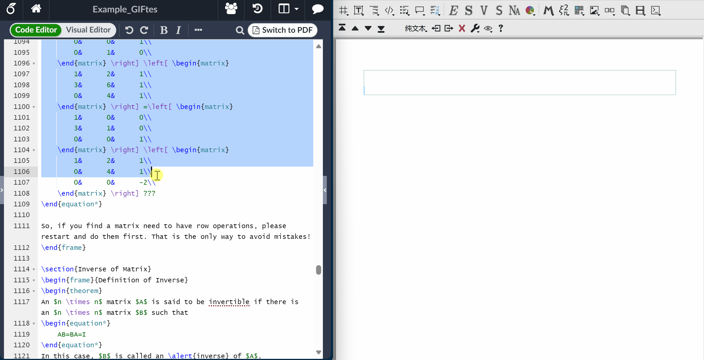
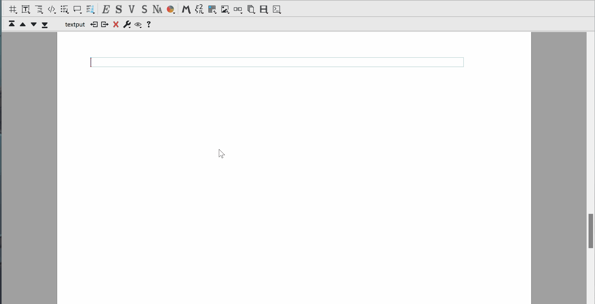

> 往下翻有我以往文章的详细介绍！

|          | 网址                                                                                            | 介绍                   | 语言                                        | 定价   |
| -------- | --------------------------------------------------------------------------------------------- | -------------------- | ----------------------------------------- | ---- |
| mogan    | [墨干 \| 探索科学与技术 (mogan.app)](https://mogan.app/zh/)                                            | 基于GNU TeXmacs 底层+中文优化 所见即所得 底层文本，编辑近似docx 对数学支持更好 | TeXmacs/tmu 支持LaTeX\|html等 导入导出     | Free |
| liii     | [三鲤AI理工套件 \| explore science and technology (liiistem.cn)](https://liiistem.cn/)              | 拥有大模型集成 和更快技术支持的mogan   | 同上                                        | 你猜   |
| obsidian | [Obsidian - Sharpen your thinking](https://obsidian.md/)                                      | 用来做笔记好 插件丰富前端很爽   | markdown/LaTeX 通过pandoc导入导出 docx\|html等 | Free |
| vscode   | [Visual Studio Code - Code Editing. Redefined](https://code.visualstudio.com/)                | 宇宙编辑器 靠插件实现许多功能   | markdown/LaTeX                            | Free |
| typora   | [Typora 官方中文站 (typoraio.cn)](https://typoraio.cn/)                                            | 真没用过                 | markdown/LaTeX                            | 89   |
| overleaf | [Login - Sharelatex by SUSTech CRA, Online LaTeX Editor](https://sharelatex.cra.ac.cn/login?) | 由CRA负责维护的在线overleaf  | LaTeX                                     | Free |

> obsidian定位比较尴尬，更接近知识管理软件，而且不完全是面向代码和理工类写作的，不过对前端开发者确实很友好。

## Mogan

以下是我为Mogan和Liii制作的GIF：

魔法粘贴，完美兼容LaTeX，解决讨厌的矩阵编辑问题。

## Liii

大模型集成(看见列表中的Elvish没？我们支持命令行等:)

## Typora

一篇介绍Markdown，css等技术栈很好的文章，从使用到开发和定制：[Typora 完全使用详解 - 少数派 (sspai.com)](https://sspai.com/post/54912)

## Obsidian

[我写的obsidian使用文章](https://liubinfighter.github.io/Blog/tags/obsidian/)
