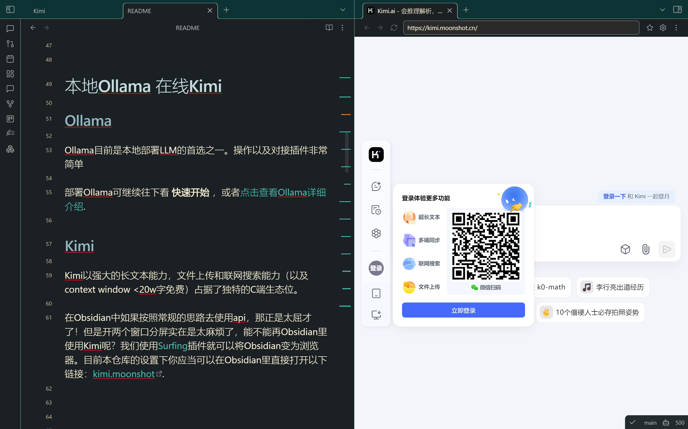
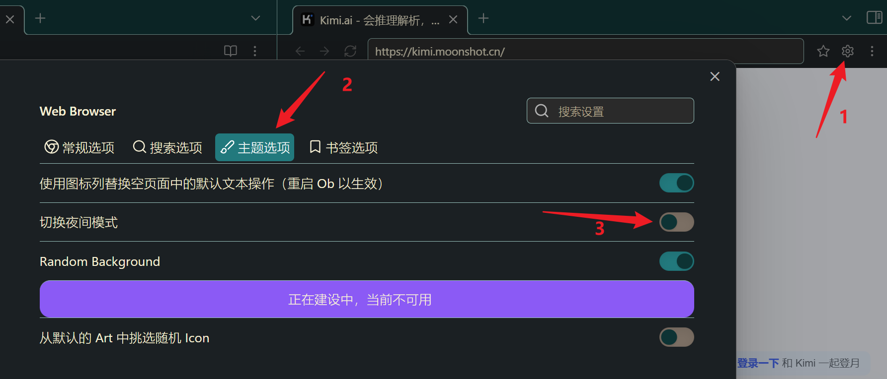
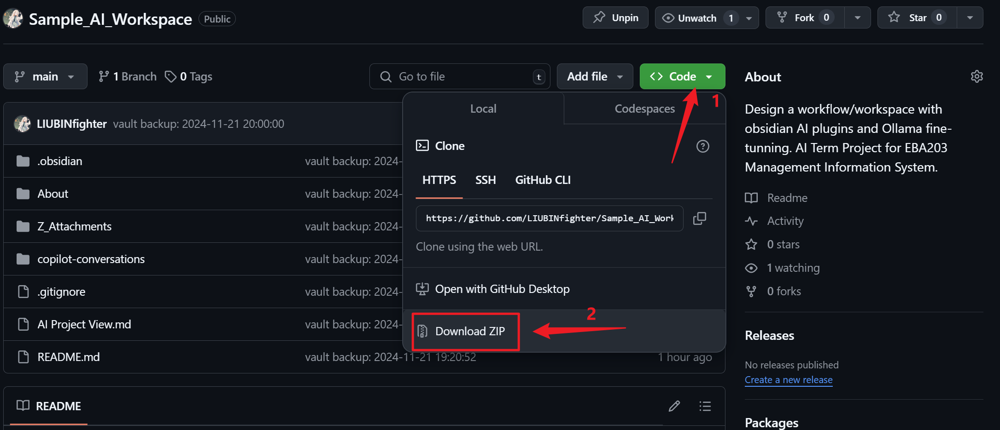
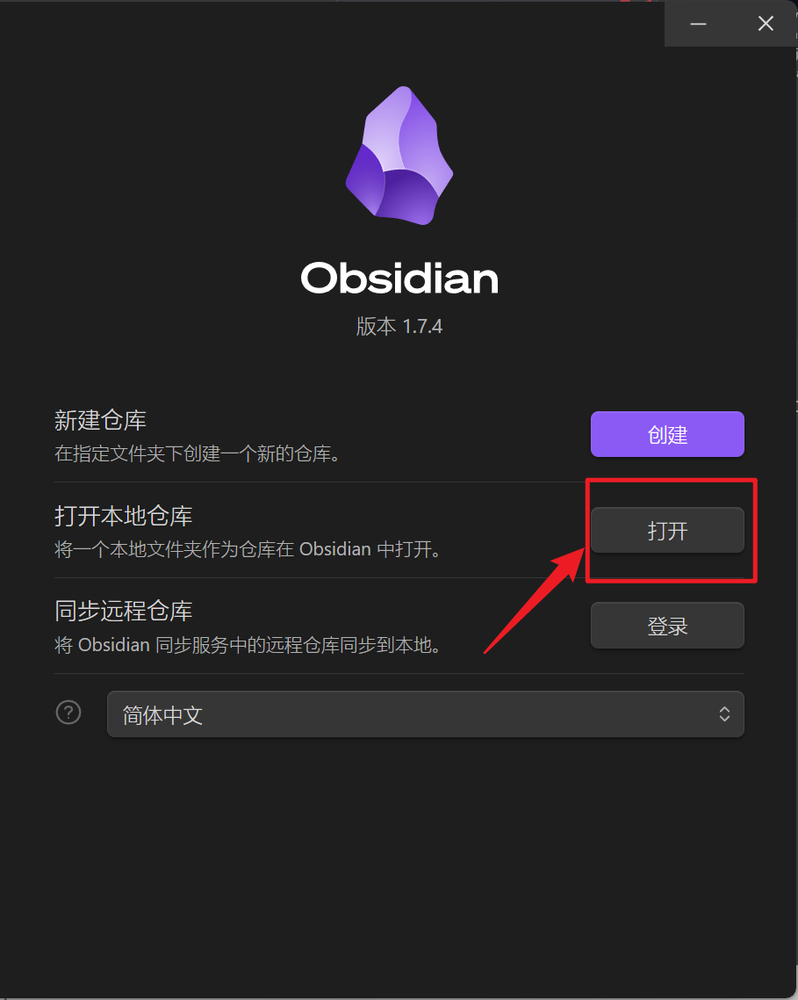
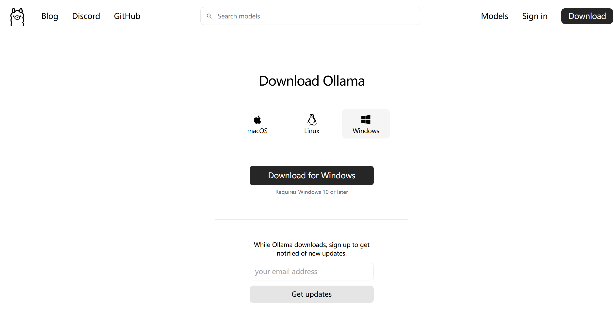
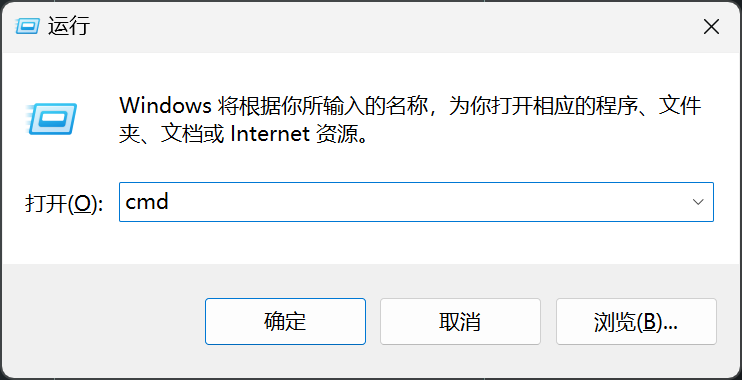
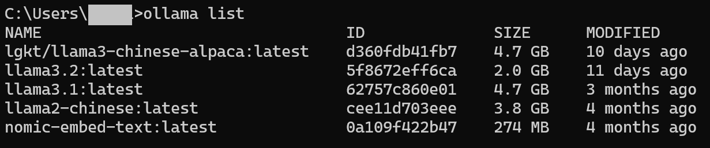
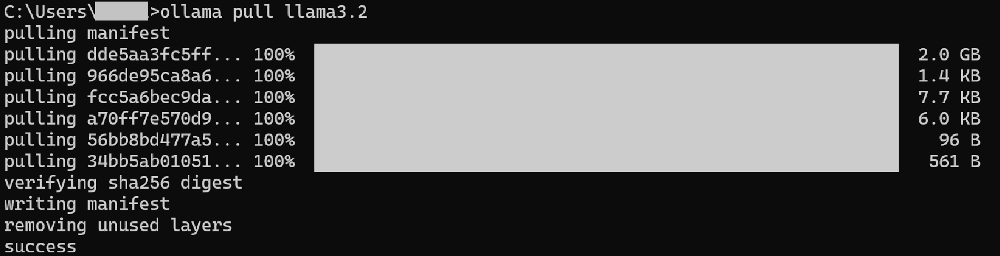

项目地址：<https://github.com/LIUBINfighter/Sample_AI_Workspace>

# Overview

本仓库是为了向Obsidian新手介绍Obsidian中的AI工作流而打造的。

Obsidian的学习曲线本就比较陡峭，如果再加上自己部署LLM服务则要同时学习LLM部署和Obsidian各AI插件的对接。我对本仓库的设计以及对应文档的写作就是Obsidian新手加快将AI融入Obsidian工作流的进程，按图索骥修改配置后根据效果自行取舍和进行个性化设置。

本次使用的AI插件为（排名为个人喜好）：

- Local GPT
    脱离鼠标，只用键盘
    提示词定制程度高，在文档中丝滑写作，添加表情包，概括，整理思路，修改错误
- Text Generator
    定制程度极高，上限高
    可以自行根据LLM服务商手册+Advanced Setting自由定制
- Copilot
    新兴插件，期待前途
- Smart2Brain
    最早入坑的插件，之后效果不是很稳定，现在开发者也不活跃
    （凑数的）

为了更大程度发挥各AI插件的功能，我根据我自己的习惯设置了其他的插件，包括：

- Kanban
    看板插件，所有文档分类一目了然
- Surfing
    在Obsidian中内置浏览器，进行搜索和在线LLM使用（Kimi赛高！）
- Git以及本地化
    远程同步github仓库，保存你的项目进度
    （保持本地化可直接zip下载/取消/删除插件）

>对本地化有执念？担心仓库联网？请查阅：[Git以及本地化](https://github.com/LIUBINfighter/Sample_AI_Workspace/blob/main/docs/Git%E4%BB%A5%E5%8F%8A%E6%9C%AC%E5%9C%B0%E5%8C%96.md)文档.

# 插件横纵对比

Obsidian仓库设置，当然要以插件为主啦！所以我们优先介绍插件。以下内容主要都依据2024年11月22日访问+使用并制表。

如果有些糊涂，可以略过两个枯燥的表格，直接看我的主观体验就行。

对表格中的细节有疑惑，直接点击表格中的文件链接即可跳转（这里假设是obsidian环境）。

> update: 将文件路径替换为完整相对路径后，在github上也可以完整预览本仓库的绝大多数文档。

## 基本情况

Repo为插件github repo地址。

| Name                                                    | Repo                                                                                                | Download | Star | Update      |
| ------------------------------------------------------- | --------------------------------------------------------------------------------------------------- | -------- | ---- | ----------- |
| Text Generator | [nhaouari/obsidian-textgenerator-plugin](https://github.com/nhaouari/obsidian-textgenerator-plugin) | 335k     | 1.5k | 3weeks ago  |
| Local GPT           | [pfrankov/obsidian-local-gpt](https://github.com/pfrankov/obsidian-local-gpt)                       | 18.7k    | 328  | last week   |
| Copilot                 | [logancyang/obsidian-copilot](https://github.com/logancyang/obsidian-copilot)                       | 264k     | 3.1k | 9 hours ago |
| Smart2Brain         | [your-papa/obsidian-Smart2Brain](https://github.com/your-papa/obsidian-Smart2Brain)                 | 25.1k    | 633  | 6months ago |

非常感谢社区的插件作者以及其他热衷于分享和帮助他人的参与者！

## 功能介绍

对这些细节有疑惑？我会在每个插件单独的文档中详细解释。

| Name                                                    | 边栏QA | 选定内容输入        | 阅读<br>.md  | 多文件               | 外链跳转           | 定制提示词                 | 定制传输格式     |
| ------------------------------------------------------- | ---- | ------------- | ---------- | ----------------- | -------------- | --------------------- | ---------- |
| Text Generator | ❌    | ✔             | ✔          | ❌                 | ❌              | ✔                     | ✔已有模板+自由定制 |
| Local GPT           | ❌    | ✔<br>选中+自设快捷键 | ✔          | ❌<br>只支持在编辑的文档中解读 | ❌不能多文件联动       | 🔥插件面板设置<br>+社区支持     | ❌          |
| Copilot                 | ✔    | ✔<br>选中+右键    | ✔<br>提示词模板 | ✔<br>可调整文件数       | ✔较准确<br>❌跳转抽风  | 只支持1种自定义System Prompt | ❌          |
| Smart2Brain         | ✔    | ❌<br>手动复制粘贴   | ✔          | ✔<br>可调整相似度       | 🤔不太准<br>✔跳转稳定 | ❌                     | ❌          |

## 主观评价

| Name                                                    |                                         |
| ------------------------------------------------------- | --------------------------------------- |
| Text Generator | 热爱折腾必备，定制化程度取决于耐心和技术文档，接入Kimi需要看文档调body |
| Local GPT           | 使用最频繁，快捷键调用定制提示词模板超好用，脱离鼠标              |
| Copilot                 | 有概括菜单栏以及聊天+仓库问答格式,但是跳转经常不成功             |
| Smart2Brain         | 多文件阅读挺不错，也会提供地址跳转，简单快速，但是插件容易莫名其妙崩溃     |

## 效果示意

[Example-Summary README](https://github.com/LIUBINfighter/Sample_AI_Workspace/blob/main/_Workspace/Example-Summary.md)

## Copilot

[Documentation | Copilot for Obsidian (obsidiancopilot.com)](https://www.obsidiancopilot.com/en/docs)

# 本地Ollama 在线Kimi

## Ollama

Ollama目前是本地部署LLM的首选之一。操作以及对接插件非常简单

部署Ollama可继续往下看 **[快速开始](https://github.com/LIUBINfighter/Sample_AI_Workspace?tab=readme-ov-file#%E5%BF%AB%E9%80%9F%E5%BC%80%E5%A7%8B)** ，或者[点击查看Ollama详细介绍](https://github.com/LIUBINfighter/Sample_AI_Workspace/blob/main/docs/BaseLLM/Ollama.md).

## Kimi

Kimi以强大的长文本能力，文件上传和联网搜索能力（以及context window <20w字免费）占据了独特的C端生态位（反正我是不能没有Kimi了）。

在Obsidian中如果按照常规的思路去使用api，那真是太屈才了！但是开两个窗口分屏实在是太麻烦了，能不能再Obsidian里使用Kimi呢？我们使用[Surfing](https://github.com/LIUBINfighter/Sample_AI_Workspace/blob/main/docs/Surfing.md)插件就可以将Obsidian变为浏览器。目前本仓库的设置下你应当可以在Obsidian里直接打开以下链接：[kimi.moonshot](https://kimi.moonshot.cn/).



扫码登录一气呵成。如果你喜欢暗色主题也可以用Suring切换。



如果你想要接入API，请参考：[Kimi](https://github.com/LIUBINfighter/Sample_AI_Workspace/blob/main/docs/BaseLLM/Kimi.md)

# 快速开始

本栏目是为了快速使用配置最简单基础，最快速的LocalGPT插件。

你可以在Obsidian下查看[AI Project View](https://github.com/LIUBINfighter/Sample_AI_Workspace/blob/main/docs/AI%20Project%20View.md)以浏览感兴趣的其他设置和插件介绍。

下载安装包（git clone有时会卡住）


解压缩到你想要的位置，通过压缩包下载后解压将不会有.git文件夹。如果你会使用git则可自行修改仓库名称并添加到repo。

## 使用Obsidian打开



打开后你可以在Obsidian里阅读本教程了。当然，别急着关网页！涉及Obsidian设置一类操作的时候还是要看网页的。我建议从这一步之后就在Obsidian里查看本教程并进行其他操作。

插件已经预设完成，我们去配置Ollama作为本地LLM服务。

## 配置Ollama

### Windows



`win+r`呼出
win+R输入cmd运行enter确定


输入

```bash
ollama list
```



如果你刚下载Ollama，那么应当只有NAME-ID-SIZE-MODIFIED一行,没有其他的模型。

我们要使用llama3.2（LocalGPT只需要这个，用于Chat）以及nomic-embed-text（Copilot以及Smart2Brain额外需要用于索引）.



我C盘够大，模型随便下。但是如果C盘本来空间不多，可能需要修改ollama配置使得模型文件保存在其他位置。

### Ubuntu

我们用snap下载ollama，其他操作和windows没有太大区别。

```bash
sudo snap install ollama
```

更多个性化配置参考[Ollama](https://github.com/LIUBINfighter/Sample_AI_Workspace/blob/main/docs/BaseLLM/Ollama.md)以及Ollama官网 <https://ollama.com/>

# 多余的话

## Obsidian链接与Git Repo

为了保证README能在repo上完整呈现，我将所有照片等附件都改为了完整相对路径，例如：``。可在设置中重新设置为最简形式，形如：`[[Kimi]]`或者 `![[Kimi.png]]`。

文档中不定期出现链接错误，是由于Obsidian本地使用和github在线阅读之间的取舍不同。你可以在issue区写下问题和你的建议。

# 外链

## Obsidian Plugin

| Name           | Github Repo                                                                                         | doc/wiki                                                                                                                                            |
| -------------- | --------------------------------------------------------------------------------------------------- | --------------------------------------------------------------------------------------------------------------------------------------------------- |
| Text Generator | [nhaouari/obsidian-textgenerator-plugin](https://github.com/nhaouari/obsidian-textgenerator-plugin) | - <https://text-gen.com/><br>- <https://docs.text-gen.com/>                                                                                             |
| Local GPT      | [pfrankov/obsidian-local-gpt](https://github.com/pfrankov/obsidian-local-gpt)                       |                                                                                                                                                     |
| Copilot        | [logancyang/obsidian-copilot](https://github.com/logancyang/obsidian-copilot)                       | - [obsidian copilot](https://www.obsidiancopilot.com/en)<br>- [Documentation \| Copilot for Obsidian](https://www.obsidiancopilot.com/en/docs)<br> |
| Smart2Brain    | [your-papa/obsidian-Smart2Brain](https://github.com/your-papa/obsidian-Smart2Brain)                 |                                                                                                                                                     |

## LLM Provider

| Name     | Docs                                                                                                               | 在线使用Kimi                                                                                                                                  |
| -------- | ------------------------------------------------------------------------------------------------------------------ | ----------------------------------------------------------------------------------------------------------------------------------------- |
| Moonshot | [Moonshot AI 开放平台](https://platform.moonshot.cn/docs/intro#%E6%96%87%E6%9C%AC%E7%94%9F%E6%88%90%E6%A8%A1%E5%9E%8B) | [Kimi.ai - 会推理解析，能深度思考的AI助手 (moonshot.cn)](https://kimi.moonshot.cn/)                                                                     |
|          | 官网                                                                                                                 | Github Repo                                                                                                                               |
| Ollama   | [Ollama](https://ollama.com/)                                                                                      | [ollama/ollama: Get up and running with Llama 3.2, Mistral, Gemma 2, and other large language models.](https://github.com/ollama/ollama) |
