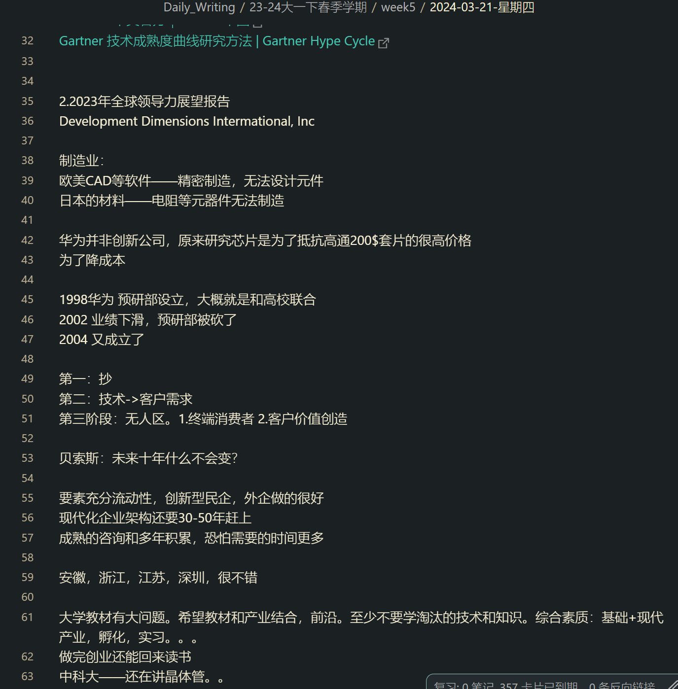

按：此文仅是为了存档，为其他材料做超链接用，当时的笔记相对混乱，未经审查，不代表任何观点立场。

讲座时间 2024-03-21 星期四

讲座地点 南方科技大学 商学院大成礼堂

---

兰涛 17年华为工作经验 讲得很好，主要是问一些问题

Gartner咨询公司，AI发展路线图

Hype Cycle for Artificial Intellgence,2023

1.[Gartner中文官方｜Gartner中国](https://www.gartner.com/cn)

[Gartner 技术成熟度曲线研究方法 | Gartner Hype Cycle](https://www.gartner.com/cn/research/methodologies/gartner-hype-cycle)

2.2023年全球领导力展望报告

Development Dimensions Intermational, Inc

制造业：

欧美CAD等软件——精密制造，无法设计元件

日本的材料——电阻等元器件无法制造

华为并非创新公司，原来研究芯片是为了抵抗高通200$套片的很高价格,为了降成本

1998华为 预研部设立，大概就是和高校联合

2002 业绩下滑，预研部被砍了

2004 又成立了

第一：抄

第二：技术->客户需求

第三阶段：无人区。1.终端消费者 2.客户价值创造

贝索斯：未来十年什么不会变？

要素充分流动性，创新型民企，外企做的很好

现代化企业架构还要30-50年赶上

成熟的咨询和多年积累，恐怕需要的时间更多

安徽，浙江，江苏，深圳，很不错

大学教材有大问题。希望教材和产业结合，前沿。至少不要学淘汰的技术和知识。综合素质：基础+现代产业，孵化，实习。。。

做完创业还能回来读书

中科大——还在讲晶体管。。

---

### Obsidian 仓库快照

