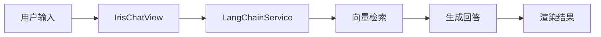
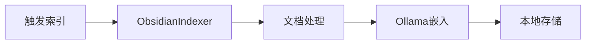

## 项目架构

### 1. 整体架构

项目采用了典型的 MVC 架构模式，主要分为以下几层：

```typescript
src/
├── main.ts              # 控制器层：插件主入口
├── views/               # 视图层：UI组件
├── services/            # 服务层：核心业务逻辑
├── utils/              # 工具层：通用功能
└── interface.ts        # 接口定义层
```

### 2. 核心模块分析

#### 2.1 控制器层 (main.ts)

```typescript
export default class Iris extends Plugin {
    private langchain: LangChainService;
    private ollamaService: OllamaService;
    private vectorStore: LocalVectorStore;
    public indexer: ObsidianIndexer;
    
    async onload() {
        // 1. 初始化服务
        // 2. 注册视图
        // 3. 添加命令
        // 4. 设置状态栏
    }
}
```

主要职责：

- 服务初始化和生命周期管理
- 视图注册
- 命令注册
- 状态管理

#### 2.2 服务层 (services/)

1. **LangChain服务 (langchain.ts)**

```typescript
export class LangChainService {
    // RAG查询
    async ragQuery(question: string, callback: (chunk: StreamMessage) => void)
    
    // 对话查询
    async chatQuery(input: string, callback: (chunk: StreamMessage) => void)
    
    // 执行动作
    async executeAction(action: IrisAction, input: string)
}
```

2. **Ollama服务 (ollama.ts)**

```typescript
export class OllamaService {
    // 嵌入生成
    async embedDocuments(texts: string[]): Promise<number[][]>
    
    // 查询嵌入
    async embedQuery(text: string): Promise<number[]>
    
    // 连接测试
    async testConnection(): Promise<boolean>
}
```

3. **索引服务 (indexer.ts)**

```typescript
export class ObsidianIndexer {
    // 索引仓库
    async indexVault(options?: IndexOptions)
    
    // 相似搜索
    async searchSimilar(query: string, limit: number)
}
```

#### 2.3 视图层 (views/)

**聊天视图 (chat-view.ts)**

```typescript
export class IrisChatView extends ItemView {
    // 消息渲染
    private async renderMessage(message: ChatMessage)
    
    // 动作执行
    private async executeAction(action: IrisAction)
    
    // 模式切换
    private switchMode(mode: ChatMode)
}
```

#### 2.4 接口定义 (interface.ts)

```typescript
// 核心接口定义
export interface {
    ChatMessage,
    StreamMessage,
    Document,
    IrisAction,
    IrisWorkflow,
    // ...
}
```

### 3. 数据流转

1. **RAG查询流程**:



2. **索引流程**:



### 4. 特色封装

1. **动作系统**

```typescript
interface IrisAction {
    id: string;
    name: string;
    prompt: string;
    params?: IrisActionParam[];
    quickInputs?: QuickInput[];
}
```

- 支持参数配置
- 快速输入选项
- 自定义图标

2. **工作流系统**

```typescript
interface IrisWorkflow {
    id: string;
    type: WorkflowType;
    chainType?: 'stuff' | 'map_reduce' | 'refine';
    useRag?: boolean;
    useMemory?: boolean;
}
```

- 支持多种链类型
- RAG增强选项
- 记忆管理

3. **状态管理**

```typescript
// 状态栏显示
this.statusBarItem = this.addStatusBarItem();
this.statusBarItem.addClass('iris-status-bar-item');
```

### 5. 建议优化方向

1. **错误处理体系**

- 添加统一的错误处理机制
- 实现错误重试策略

2. **缓存机制**

- 添加向量缓存
- 实现会话缓存

3. **性能优化**

- 实现增量索引
- 优化大文件处理

4. **用户体验**

- 添加进度反馈
- 优化加载状态
- 增强错误提示


## 和cursor互动合作

### .cursorrules

```prompt
Always respond in 中文

目前你使用的技术框架为原生typescript，开发obsidian插件。（不使用vue等框架！）
请随时记住你的记忆有限，对于你认为多余的代码不要擅自删改，添加新的兼容的代码就好。对于删除的代码，必须给出不得不删除的明确理由。

如果你认为提供的文件不够，请直接提出。

这个项目叫Iris，我希望她作为obsidian插件，有出色的前端交互体验（交互逻辑与style.css渲染），后端能接入ollama等服务，我们自己的后端通过tslangchain框架，进行rag服务。

目前开发mvp产品，最重要的是实现仓库所有文件的索引以及增强检索（RAG与传统检索集合），用户能在settingtab栏设置重新index和自设提示词，以及请求头headder/body，能在obsidian交互页面ribbon actions，command呼出右侧View 右侧视图，status bar 右下角显示加载进度

和Iris命名相关的：IrisSetting IrisTabSetting（设置栏以及设置栏显示，用户自己的设置写入data.json） IrisModalSetting（模态框调用）等

新增的Feature，首先告诉我适合用来作为commit内容的题目，然后在interface.ts里面定义相关接口，main.ts里import调用
和rag以及llm调用相关的，使用langchain.ts以及ollama实现
和索引相关的，使用indexer.ts
文件系统以及editor相关，使用monitor.ts
处理的小工具（比如之后会开发的多模态支持，以及日志系统），放在utils/helpers.ts
以上是默认要求。以下是在具体开发中遇到的问题：

```

## 知识点：MVC架构

MVC（Model-View-Controller）架构模式是一种软件设计模式，用于实现用户界面与业务逻辑的分离。它将应用程序分为三个核心组件：模型（Model）、视图（View）和控制器（Controller）。这种模式有助于提高应用程序的可维护性和可扩展性，并且使得开发人员可以专注于各自独立的部分。下面是这三个组件的简要说明：

1. **模型（Model）**：
   - 代表应用程序的数据结构和业务逻辑。
   - 负责数据的存储、检索和操作。
   - 通常包括数据验证和设置规则。

2. **视图（View）**：
   - 负责显示数据（即模型）给用户，并收集用户输入。
   - 是用户界面的一部分，用户通过视图与应用程序进行交互。
   - 视图不包含业务逻辑，它只负责展示模型的数据和接收用户指令。

3. **控制器（Controller）**：
   - 作为模型和视图之间的中介。
   - 接收用户的输入并调用模型和视图去完成用户的需求。
   - 控制应用程序的流程，根据用户的输入调用模型更新数据，然后选择合适的视图显示给用户。

MVC模式的工作原理通常如下：
- 用户通过视图进行操作，比如点击按钮或输入数据。
- 控制器接收到用户的输入后，解释这些输入，并调用模型进行相应的业务逻辑处理。
- 模型处理完业务逻辑后，会更新数据。
- 控制器通知视图更新显示，以反映模型中的数据变化。

MVC模式的一个关键优点是它支持并行开发，不同的开发人员可以同时工作在模型、视图和控制器上，而不会相互干扰。此外，MVC也有助于测试和调试，因为每个组件都是独立的，可以单独测试。
