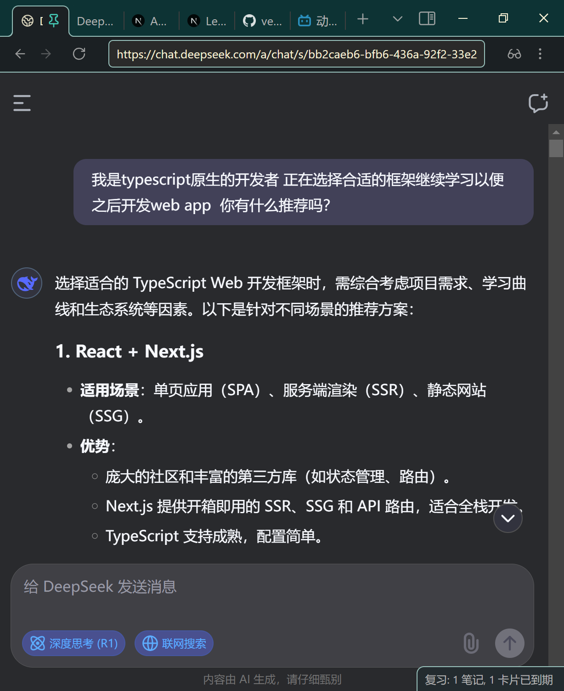
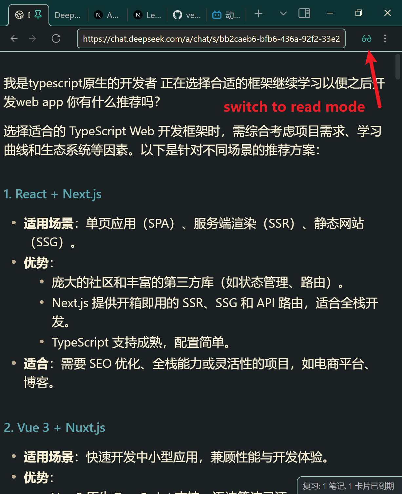
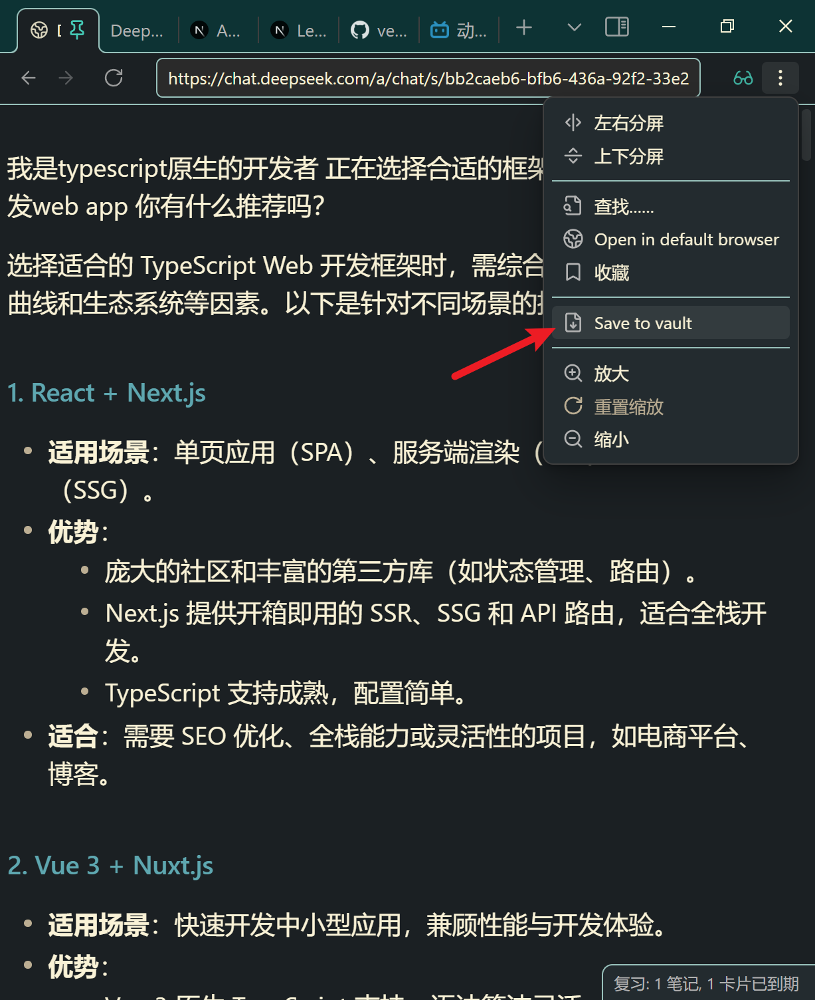
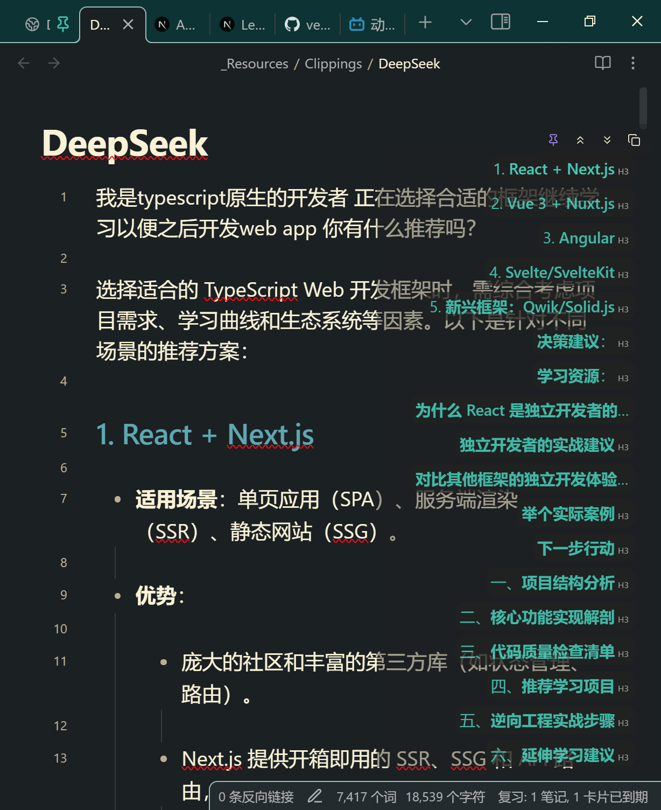
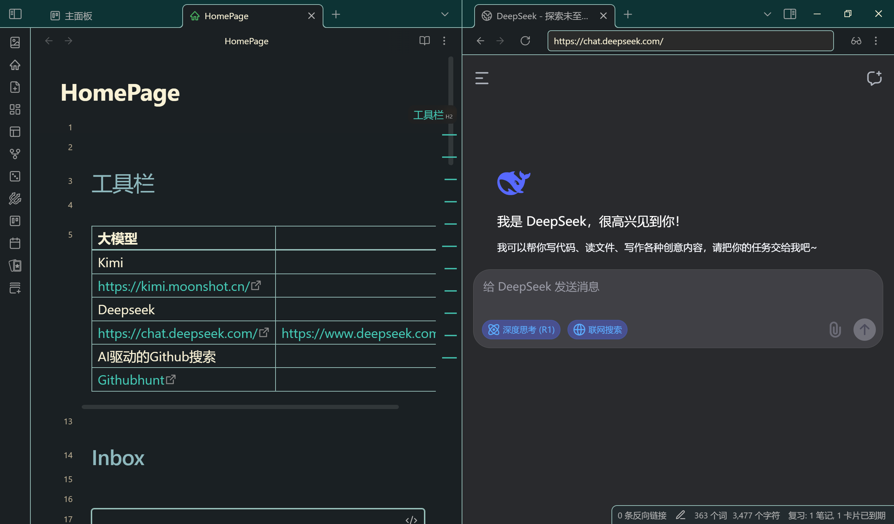
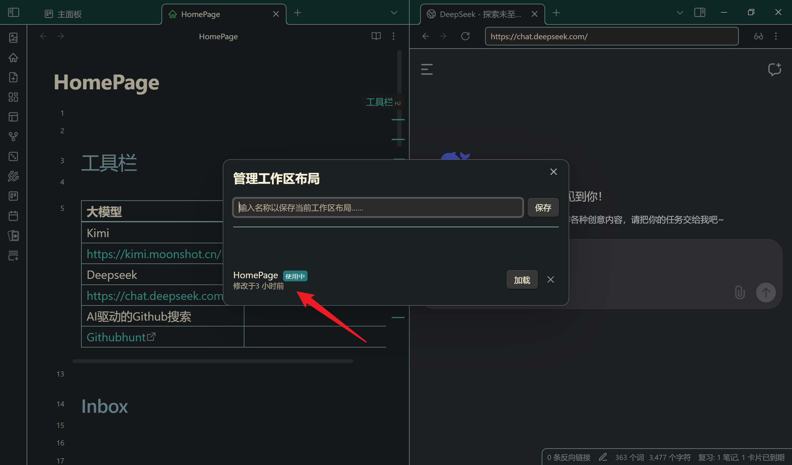
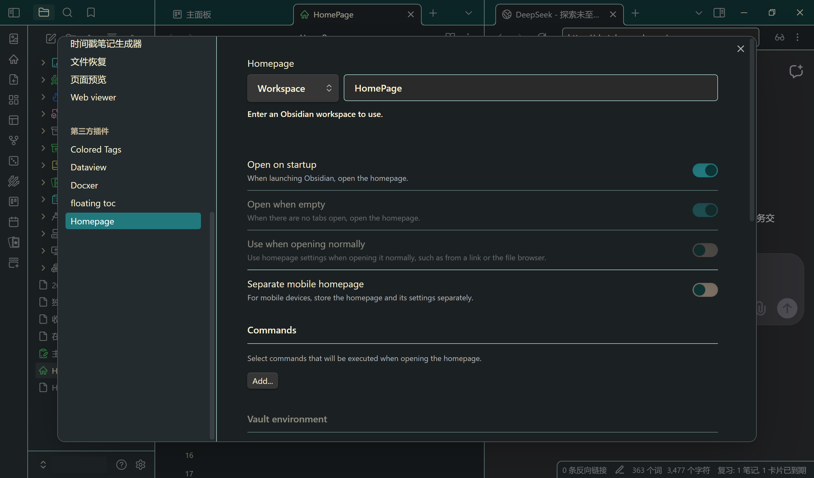
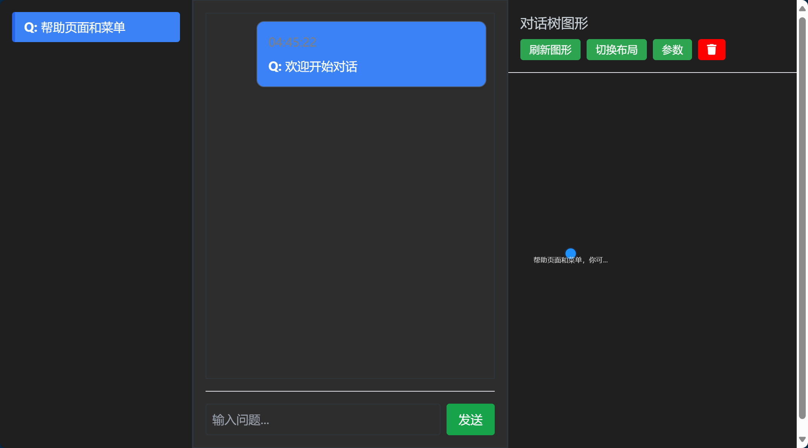
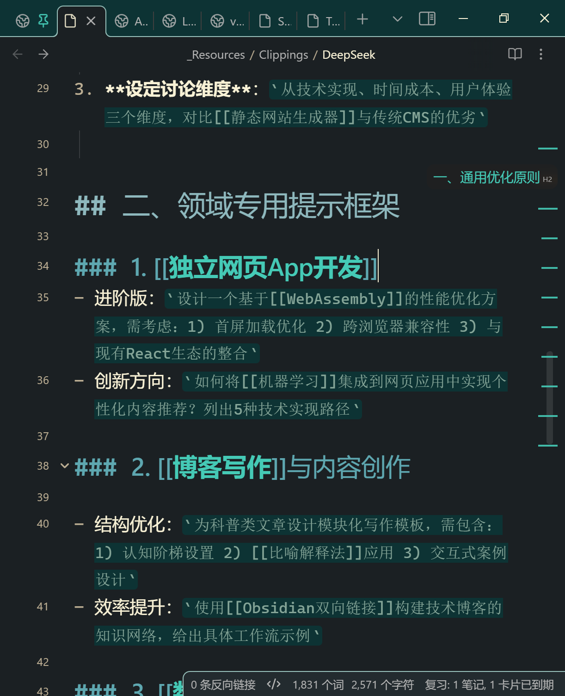

> `deepseek-r1`  `obsidian` `markdown` `xml` `homepage` `workspace`

## 前言 在浏览器的道路上越走越远

在这个版本中，Web Viewer插件允许用户在Obsidian中直接浏览网页，并将网页内容无缝转换为Markdown格式。这极大地提升了用户在Obsidian中的工作流效率，特别是对于需要频繁引用网页内容的用户来说。

通过Web Viewer，用户可以：

- 直接在Obsidian中打开网页，无需切换到浏览器。
- 一键将网页内容转换为Markdown格式，并保存到笔记中。
- 轻松管理和编辑从网页导入的内容。

在我看来，这个插件比surfing在转换页面上更稳定，特别是添加了markdown转换预览，直观展现转换后的笔记样式，比web clipper抽奖安心多了。

## 基础操作

问问题，预览回答后直接保存就行，操作如图。

如果需要CoT（思考过程）展开即可；不需要把思考过程收起来，web viewer在预览的时候就不会纳入这些文字。

<table>
    <tr>
        <td></td>
        <td></td>
    </tr>
    <tr>
        <td></td>
        <td></td>
    </tr>
</table>

不过这一套流程也有缺点，那就是保存后的页面笔记都是deepseek，需要自己手动改文件名称。

## 进阶使用

### 搭配homepage设置workspace页面调用deepseek

由于还没有收藏夹功能，每次都要自动呼出deepseek比较麻烦。特别是在一些特定的项目下需要频繁调用chat类（我们还是用deepseek为例子，但是所有的网页端LLM Chat原理都一样，包括ChatGPT，Kimi，Gemini等）。

我们调整好使用deepseek的页面布局后设置Workspace，就能通过调用workspace呼出合适的页面布局（包括webviewer下的网页）。





这里homepage其实只是方便了workspace的调用（侧边栏Robbin Icon呼出），核心在于workspace兼容。在这个页面可以把刚刚布置好的工作区设置为homepage，作为最常用的工作布局。



### 使用标记语言适配双链笔记

对于一些关键的概念或者多个方案，我们往往需要多线程地提问和思考，这时线性的Chat就显得有些招架不住。

其实这有点像对话时进行分支，我之前写过一个类似的对话分支页面[Deepseek-BranchMind](https://github.com/LIUBINfighter/Deepseek-BranchMind)，可惜不咋好用：



在obsidian里使用[[]]创建双链笔记非常方便，可以对一些技术性细节进行进一步分支和探索，只需要在提示词后加入标记语言，deepseek-r1就能很好的理解你所需要的格式。例如：

```
你好，deepseek!
如何优化和ai进行头脑风暴的提示词？
我想要的探讨的领域一般是独立网页app开发，博客写作，数学物理学习，INTP人格成长，阅读和写作，作息和健康等主题。

<format>
- 按照合适的markdown格式输出
- 在输出内容中对于合适的可拓展的主题，使用[[]]进行包裹，比如：[[React单页应用(SPA)]]
<format\>
```

这样，在转换网页后只需要在对应的网页点击[[]]双联创建笔记就可以把新的所思所想写在独立的笔记里，并和之前的笔记进行关联。


